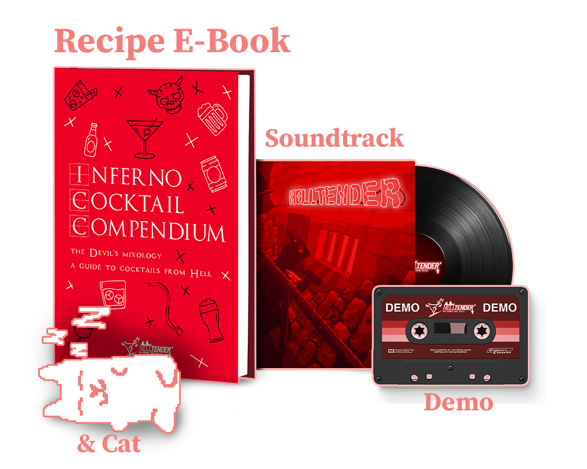

> `firebase logout` `firebase login` to refresh auth and login
> `firebase serve` to deploy local site

  <!-- <section  class="main-section">
                

                

                    <h2 class="column-title">Join the Mailing List to get gifts! (When the kickstarter launches)</h2>
                    
                   <iframe width="540" height="505" src="https://35adcb0e.sibforms.com/serve/MUIFAFnTJN1lCKG0vJjtR30eHRc810pQC0sl9HXbgdWWxtz9wofCFIiSitjZ-zDWPEwjROE7fOk9lkE-ZTb1PHU0aphCEz7bWO468K_pzH8xnw5LJyJIqx0yh6pMjWJHTegYBJJyBcfVQhKE7EL3sHfIWB7RybUZIv5A3Uz4_c_4zi81xKZDJnLYAHH5MIsw1arY8DK-927C2ha8" frameborder="0" scrolling="auto" allowfullscreen style="display: block;margin-left: auto;margin-right: auto;max-width: 100%;"></iframe>
                

                

                        
 
                            I don't actually have the gifts ready yet. :P Cocktails haven't been finalised yet, don't have a composer amd still working on the demo. But you'll be the first to get access to these when they are eventually done.
                        

                        
 
                            If the promised of gifts are not enough for you, here's a free cat, maybe this will convince you to sign up!
                        

                        
                        <h2 class="column-title">Support Me! (╯°□°）╯︵ ┻━┻</h2>
                        
 
                            If you are crazy enough to throw money my way, have at it!
                        

                        

                

                   
                   <em>If you join the mailing list and donate...</em>
                

            

                        

                        <b>£5 or more</b>
 

                        <ul>
                            <li>Feel good about donating!</li>
                        </ul>
                        
<b>£10 or more</b>

                        <ul>
                            <li>Digital copy of game on launch</li>
                            <li>Special Discord Role</li>
                            
                        </ul>
                        

                        <b>£15 or more</b>

                        <ul>
                            <li>2 copies of the game on launch, one for you and one for a friend!</li>
                        </ul> 
                         

                        

                        

                            

                            
                            
                        

                            
                            
                        
 

                

            

            </section> -->

            <!-- 
 -->
